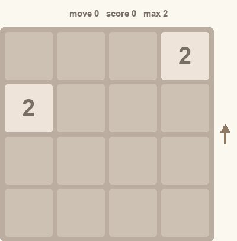

# RLfor2048
I often play [2048](https://play2048.co/) as a distraction. Over the years, I have gotten somewhat good at it but I play with no real strategy. I had grand visions of using reinforcement learning to train a network to be really good at the game _and_ thereby, learn good strategies for solving the game. As it happened, the network needed some hand holding and expert knowledge (reward shaping) to achieve its objective but this was still a fun project and a good opportunity for me to teach myself some concepts in reinforcement learning.

This repo has the code and a report detailing the algorithm's inner workings. I used LLMs extensively for code generation but went through every line to ensure I understood them. The documentation is mostly mine with occasional consultations with LLMs on technical points. The animations were rendered by the excellent [manim](https://www.manim.community/) package developed by the incomparable [Grant Sanderson](https://www.3blue1brown.com/) - this code is all LLMs with my role being just verifying the final outputs.

Here is a sneak peak of the output after training for 500,000 games and nearly 250 million moves.

Watch a full game

